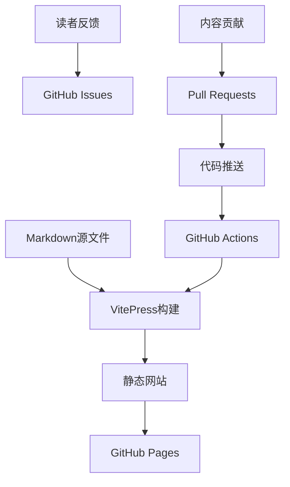

# 关于

## 关于这本书

这是一个展示如何使用GitHub创建动态更新书籍的实验性项目。它不仅仅是一本书，更是一个关于现代数字出版、协作学习和知识分享的探索。

### 项目愿景

在信息爆炸的时代，我们需要新的方式来组织、分享和更新知识。传统的出版模式已经无法满足快速变化的需求。这个项目试图探索：

- 📚 **动态内容**：如何创建可以持续更新的数字内容
- 🤝 **协作编写**：如何让多人参与内容创作和改进
- 🔄 **版本控制**：如何追踪和管理内容的演进历史
- 🌐 **开放获取**：如何让知识更容易获得和传播

### 技术特色

- **现代化技术栈**：基于VitePress、Vue.js和GitHub Actions
- **响应式设计**：完美适配桌面、平板和手机
- **搜索功能**：内置全文搜索，快速定位内容
- **自动部署**：每次更新自动构建和发布
- **版本控制**：利用Git追踪每一次变更

## 关于作者

### 背景介绍

我是一名对教育技术和AI应用充满热情的学习者和实践者。在这个快速变化的时代，我深深感受到传统学习和知识分享方式的局限性，因此开始探索新的可能性。

### 兴趣领域

- 🤖 **人工智能在教育中的应用**
- 📖 **数字化学习和知识管理**
- 💻 **开源技术和协作开发**
- 🌍 **跨文化交流和语言学习**

### 学习理念

我相信：
- 学习应该是主动的创造过程，而不是被动的接收
- 最好的学习方式是教授他人
- 技术应该服务于人，而不是相反
- 知识应该开放共享，促进集体进步

## 项目历程

### 起源

这个项目源于我与ChatGPT的一次对话。它建议我"从读者转变为生产者"，这个建议深深触动了我。我意识到，在信息时代，单纯的消费已经不够，我们需要成为知识的创造者和分享者。

### 发展

从最初的想法到现在的实现，这个项目经历了：

1. **概念形成**：思考如何创建动态更新的书籍
2. **技术选型**：选择合适的工具和平台
3. **内容创作**：将现有的思考和学习转化为结构化内容
4. **系统搭建**：建立自动化的构建和部署流程
5. **持续改进**：根据使用体验不断优化

### 未来规划

- 📈 **内容扩展**：添加更多主题和深度内容
- 🎨 **体验优化**：改进用户界面和交互体验
- 🤝 **社区建设**：吸引更多贡献者参与
- 🔧 **功能增强**：集成评论、讨论等互动功能

## 技术实现

### 架构设计

### 核心技术

- **VitePress**: 基于Vite的静态站点生成器
- **Vue.js**: 现代化的前端框架
- **GitHub Actions**: 自动化CI/CD流程
- **GitHub Pages**: 免费的静态网站托管

### 开发流程

1. **本地开发**: 使用VitePress开发服务器
2. **内容编写**: Markdown格式，支持扩展语法
3. **版本控制**: Git管理所有变更
4. **自动部署**: 推送后自动构建和发布

## 联系方式

如果你对这个项目感兴趣，或者有任何建议和想法，欢迎联系我：

### 在线交流
- 📧 **Email**: your.email@example.com
- 🐦 **Twitter**: [@yourusername](https://twitter.com/yourusername)
- 💼 **LinkedIn**: [yourprofile](https://linkedin.com/in/yourprofile)

### 项目相关
- 🐙 **GitHub**: [项目仓库](https://github.com/yourusername/my-dynamic-book)
- 💬 **讨论**: [GitHub Discussions](https://github.com/yourusername/my-dynamic-book/discussions)
- 🐛 **问题反馈**: [GitHub Issues](https://github.com/yourusername/my-dynamic-book/issues)

## 致谢

这个项目的实现离不开以下支持：

### 技术支持
- **VitePress团队** - 提供优秀的文档生成工具
- **GitHub** - 提供免费的代码托管和部署服务
- **Vue.js社区** - 强大的前端生态系统

### 灵感来源
- **ChatGPT** - 提供了"从读者到生产者"的关键启发
- **开源社区** - 展示了协作和分享的力量
- **所有读者和贡献者** - 让这个项目变得有意义

### 特别感谢
感谢所有相信知识应该开放共享的人们，是你们的理念和实践推动了这个项目的诞生。

## 许可证

本项目采用 [MIT License](https://opensource.org/licenses/MIT) 开源许可证。

这意味着：
- ✅ 可以自由使用、修改和分发
- ✅ 可以用于商业目的
- ✅ 需要保留原始许可证声明
- ❌ 不提供任何担保

## 加入我们

如果你也认同开放知识分享的理念，欢迎加入这个项目：

- 🍴 **Fork项目** 开始你的贡献
- ⭐ **Star项目** 表示支持
- 📢 **分享项目** 让更多人了解
- 💡 **提出想法** 帮助项目改进

让我们一起探索知识分享的新可能！

---

*最后更新：2025年5月* 