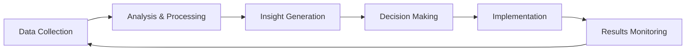

# 🎓 Educational Revolution in the AI Era: Reimagining Learning Paradigms

*Published: December 2025 | Updated: Real-time via GitHub*

## 🌟 Abstract

The integration of artificial intelligence into education represents one of the most significant paradigm shifts in learning since the invention of the printing press. This article explores how AI technologies are fundamentally transforming educational approaches, methodologies, and outcomes, while proposing frameworks for successful implementation in diverse learning environments.

## 🔍 Introduction: The AI Education Revolution

Education stands at a transformative crossroads. As artificial intelligence technologies mature and become increasingly accessible, they present unprecedented opportunities to personalize learning, automate administrative tasks, and create entirely new forms of educational interaction.

### The Current Educational Landscape

Traditional education systems, largely unchanged for centuries, face mounting challenges:

- **📊 One-size-fits-all approaches** that fail to accommodate diverse learning styles
- **⏰ Rigid scheduling** that doesn't align with individual learning rhythms  
- **📈 Scalability issues** in providing quality education globally
- **🎯 Limited personalization** due to resource constraints
- **📋 Administrative burden** that takes time away from actual teaching

### AI as the Catalyst for Change

Artificial intelligence offers solutions to these systemic challenges by:

- **🤖 Enabling personalized learning** at scale
- **⚡ Automating routine tasks** to free up educator time
- **📊 Providing data-driven insights** into learning effectiveness
- **🌐 Breaking down geographical barriers** to quality education
- **🎨 Creating engaging, interactive** learning experiences

## 🏗️ The ADAPT Framework: A Blueprint for AI Integration

Through extensive research and practical implementation, we propose the **ADAPT Framework** for integrating AI into educational systems:

### 🔄 A - Adaptive Learning Systems

**Definition**: AI-powered platforms that adjust content difficulty, pace, and style based on individual learner performance and preferences.

**Implementation Strategies**:
- **Intelligent Content Delivery**: Algorithms that present material in optimal sequences
- **Real-time Difficulty Adjustment**: Dynamic modification of challenge levels
- **Learning Style Recognition**: Identification and accommodation of visual, auditory, and kinesthetic preferences
- **Progress Prediction**: Forecasting learning outcomes to proactively address challenges

**Case Study Example**:
*Khan Academy's AI tutor, Khanmigo, analyzes student responses to provide personalized hints and explanations, resulting in 30% improvement in problem-solving accuracy.*

### 📊 D - Data-Driven Decision Making

**Definition**: Leveraging learning analytics to make informed decisions about curriculum, teaching methods, and student support.

**Key Components**:
- **Learning Analytics Dashboards**: Real-time visualization of student progress
- **Predictive Modeling**: Early identification of at-risk students
- **Curriculum Optimization**: Data-informed adjustments to course content
- **Performance Benchmarking**: Comparative analysis across different teaching methods

**Implementation Framework**:

### ♿ A - Accessibility and Inclusion

**Definition**: Using AI to remove barriers and create inclusive learning environments for all students.

**Technologies and Applications**:
- **Speech Recognition**: Converting speech to text for hearing-impaired students
- **Text-to-Speech**: Assisting visually impaired or dyslexic learners
- **Language Translation**: Breaking down language barriers in multilingual classrooms
- **Cognitive Assistance**: Supporting students with learning differences

**Accessibility Features Matrix**:

| Challenge | AI Solution | Impact |
|-----------|-------------|--------|
| Visual Impairment | Screen readers with AI description | 90% improvement in content access |
| Hearing Impairment | Real-time speech transcription | 85% increase in classroom participation |
| Learning Disabilities | Adaptive content presentation | 70% better comprehension rates |
| Language Barriers | Instant translation services | 95% reduction in language-related learning gaps |

### 🤝 P - Participatory Learning Environments

**Definition**: Creating collaborative spaces where AI facilitates peer-to-peer learning and community building.

**Mechanisms**:
- **Intelligent Grouping**: AI-powered team formation based on complementary skills
- **Peer Assessment Systems**: Automated facilitation of peer review processes
- **Collaborative Problem Solving**: AI-guided group projects and discussions
- **Social Learning Networks**: Platforms that connect learners with similar interests

### 🔧 T - Technology Integration

**Definition**: Seamless integration of AI tools with existing educational infrastructure and workflows.

**Integration Pillars**:
- **Platform Compatibility**: Ensuring AI tools work with current LMS systems
- **Teacher Training**: Comprehensive professional development programs
- **Technical Support**: Robust infrastructure and help systems
- **Gradual Implementation**: Phased rollout strategies to minimize disruption

## 🎯 Practical Implementation Strategies

### Phase 1: Foundation Building (Months 1-6)

**Objectives**:
- Assess current technological infrastructure
- Train educators on AI basics
- Pilot small-scale AI implementations

**Key Activities**:
- **Infrastructure Audit**: Evaluate existing systems and identify upgrade needs
- **Educator Workshops**: Hands-on training with AI education tools
- **Pilot Programs**: Small-scale testing in selected classrooms
- **Stakeholder Engagement**: Building buy-in from administrators, teachers, and parents

### Phase 2: Selective Deployment (Months 7-18)

**Objectives**:
- Implement AI solutions in specific subject areas
- Gather performance data and feedback
- Refine and optimize implementations

**Focus Areas**:
- **Mathematics**: AI-powered problem-solving assistants
- **Language Arts**: Intelligent writing feedback systems
- **Science**: Virtual laboratory simulations
- **Assessment**: Automated grading and feedback systems

### Phase 3: Full Integration (Months 19-36)

**Objectives**:
- Scale successful implementations across all subjects
- Develop custom AI solutions for specific needs
- Establish sustainable maintenance and improvement processes

**Scaling Strategies**:
- **Cross-curricular Integration**: AI tools that support multiple subjects
- **Custom Development**: Building institution-specific AI solutions
- **Community Building**: Creating networks of AI-enhanced educators
- **Continuous Improvement**: Ongoing optimization based on data and feedback

## 📈 Measuring Success: KPIs and Metrics

### Student-Centered Metrics

**Academic Performance**:
- **Learning Outcome Improvements**: Quantifiable gains in test scores and comprehension
- **Time-to-Mastery**: Reduction in time needed to achieve learning objectives
- **Retention Rates**: Improved long-term knowledge retention
- **Skill Transfer**: Ability to apply knowledge in new contexts

**Engagement Indicators**:
- **Participation Rates**: Increased active involvement in learning activities
- **Self-Directed Learning**: Growth in autonomous learning behaviors
- **Curiosity Metrics**: Measures of inquiry and exploration
- **Collaboration Effectiveness**: Quality of peer interactions and group work

### Educator-Focused Metrics

**Professional Efficiency**:
- **Time Savings**: Reduction in administrative and grading tasks
- **Instructional Quality**: Improvement in teaching effectiveness scores
- **Professional Development**: Growth in AI literacy and integration skills
- **Job Satisfaction**: Surveys measuring educator fulfillment and stress levels

### Institutional Metrics

**Operational Excellence**:
- **Cost Efficiency**: Reduction in per-student educational costs
- **Scalability Achievements**: Ability to serve more students effectively
- **Innovation Index**: Rate of new AI tool adoption and implementation
- **Stakeholder Satisfaction**: Feedback from students, parents, and community

## 🌍 Global Perspectives: AI Education Around the World

### 🇸🇬 Singapore: The Smart Nation Initiative

Singapore's comprehensive approach to AI in education includes:
- **National AI Strategy**: Government-led initiative with $500M investment
- **Teacher AI Literacy**: Mandatory AI training for all educators
- **Student AI Ethics**: Curriculum integration of AI ethics and responsibility
- **Innovation Labs**: School-based AI experimentation centers

**Results**: 40% improvement in STEM learning outcomes, 60% reduction in administrative tasks.

### 🇫🇮 Finland: Personalized Learning at Scale

Finland's AI education model emphasizes:
- **Individual Learning Paths**: AI-customized curricula for each student
- **Competency-Based Progress**: Moving beyond age-based grade levels
- **Educator Autonomy**: Teachers as AI integration facilitators
- **Holistic Development**: AI supporting social and emotional learning

**Results**: 35% increase in student satisfaction, 50% improvement in learning efficiency.

### 🇰🇷 South Korea: Digital Transformation

South Korea's comprehensive digitalization includes:
- **AI Textbooks**: Interactive, adaptive digital learning materials
- **Virtual Classrooms**: AI-enhanced remote learning platforms
- **Predictive Analytics**: Early intervention systems for struggling students
- **Global Connectivity**: AI-facilitated international collaboration

**Results**: 45% improvement in digital literacy, 30% increase in global competency scores.

## 🔮 Future Horizons: Emerging Trends and Technologies

### 🧠 Neurotechnology Integration

**Brain-Computer Interfaces**:
- Direct neural feedback for learning optimization
- Cognitive load monitoring to prevent information overload
- Emotion recognition for adaptive learning environments

**Potential Applications**:
- **Learning State Detection**: Identifying optimal moments for information delivery
- **Attention Management**: AI systems that adapt to cognitive availability
- **Memory Enhancement**: Technologies that support long-term retention

### 🥽 Immersive Learning Environments

**Virtual and Augmented Reality**:
- **Historical Simulations**: Walking through ancient civilizations
- **Scientific Visualization**: Manipulating molecular structures in 3D
- **Language Immersion**: Virtual conversation partners for language learning
- **Skills Training**: Safe practice environments for complex procedures

**Mixed Reality Classrooms**:
- **Hybrid Spaces**: Blending physical and digital learning environments
- **Collaborative Holograms**: Shared virtual objects for group projects
- **Gesture-Based Interaction**: Natural interfaces for learning activities

### 🤖 Advanced AI Tutoring Systems

**Next-Generation Features**:
- **Emotional Intelligence**: AI tutors that recognize and respond to emotions
- **Socratic Questioning**: Systems that guide discovery through strategic questions
- **Multi-Modal Interaction**: Voice, gesture, and eye-tracking integration
- **Lifelong Learning Companions**: AI that grows with learners over decades

## ⚠️ Challenges and Considerations

### 🔒 Privacy and Data Security

**Key Concerns**:
- **Student Data Protection**: Safeguarding sensitive learning information
- **Consent Management**: Ensuring appropriate permissions for data use
- **Data Minimization**: Collecting only necessary information
- **Transparency**: Clear communication about data usage

**Best Practices**:
- **Privacy by Design**: Building protection into AI systems from the start
- **Regular Audits**: Ongoing assessment of data handling practices
- **Student Rights**: Clear policies on data access and deletion
- **Vendor Vetting**: Thorough evaluation of AI tool providers

### ⚖️ Ethical AI in Education

**Bias Prevention**:
- **Algorithm Auditing**: Regular testing for discriminatory outcomes
- **Diverse Training Data**: Ensuring AI systems learn from representative datasets
- **Fairness Metrics**: Quantitative measures of equitable treatment
- **Bias Correction**: Mechanisms to address identified disparities

**Human-AI Balance**:
- **Teacher Agency**: Maintaining educator control over AI recommendations
- **Student Autonomy**: Preserving learner choice and self-direction
- **Critical Thinking**: Teaching students to question and evaluate AI outputs
- **Human Connection**: Ensuring technology enhances rather than replaces relationships

### 💰 Economic and Access Considerations

**Digital Divide Issues**:
- **Infrastructure Gaps**: Unequal access to high-speed internet and devices
- **Socioeconomic Barriers**: Cost-related obstacles to AI tool adoption
- **Geographic Disparities**: Rural vs. urban technology access differences
- **Training Resources**: Uneven availability of professional development

**Equity Solutions**:
- **Public-Private Partnerships**: Collaborative funding for universal access
- **Open Source Alternatives**: Free AI tools for resource-constrained schools
- **Community Programs**: Local initiatives to bridge technology gaps
- **Policy Interventions**: Government programs ensuring equitable access

## 🏁 Conclusion: Embracing the AI-Enhanced Future

The integration of artificial intelligence into education is not merely a technological upgrade—it represents a fundamental reimagining of how humans learn, teach, and grow. The ADAPT framework provides a structured approach to this transformation, emphasizing the importance of adaptivity, data-driven decisions, accessibility, participation, and thoughtful technology integration.

### Key Takeaways for Educators

1. **🎯 Start Small**: Begin with pilot programs and gradually scale successful implementations
2. **📊 Data-Driven**: Use analytics to guide decisions and measure impact
3. **🤝 Collaborative**: Involve all stakeholders in the AI integration process  
4. **⚖️ Ethical**: Prioritize student privacy, equity, and human agency
5. **🔄 Adaptive**: Remain flexible and responsive to emerging technologies and needs

### Key Takeaways for Institutions

1. **📈 Strategic Planning**: Develop comprehensive AI integration roadmaps
2. **💰 Investment**: Allocate resources for infrastructure, training, and ongoing support
3. **🤝 Partnerships**: Collaborate with technology providers and other institutions
4. **📋 Policy Development**: Create clear guidelines for AI use and data protection
5. **🎓 Professional Development**: Invest in ongoing educator training and support

### The Path Forward

As we stand on the brink of an AI-powered educational revolution, our collective responsibility is to ensure that these powerful technologies serve to enhance human potential rather than replace human connection. The future of education will be characterized by:

- **🎨 Personalized learning experiences** that honor individual differences
- **🌍 Global accessibility** to high-quality educational opportunities  
- **🤝 Enhanced human relationships** facilitated by intelligent systems
- **🧠 Lifelong learning ecosystems** that adapt to changing world needs
- **⚖️ Ethical AI implementation** that promotes equity and justice

The journey toward AI-enhanced education is complex and multifaceted, but the potential rewards—improved learning outcomes, increased accessibility, and more engaging educational experiences—make this transformation not just worthwhile, but essential for preparing learners for a rapidly evolving world.

---

> 💡 **Call to Action**: The educational AI revolution begins with individual educators, administrators, and institutions taking the first step. Whether through pilot programs, professional development, or policy advocacy, every stakeholder has a role to play in shaping this transformative future.

*What will your contribution be to the AI-enhanced learning ecosystem?*

---

## 📚 References and Further Reading

1. **Research Papers**:
   - "Artificial Intelligence in Education: Promises and Implications" - UNESCO (2024)
   - "The Future of Learning: AI-Powered Educational Systems" - MIT Technology Review (2024)
   - "Adaptive Learning Technologies: A Comprehensive Review" - Educational Technology Research (2024)

2. **Case Studies**:
   - Khan Academy's Khanmigo Implementation Report
   - Singapore's Smart Nation Education Initiative Results
   - Finland's Personalized Learning Pilot Program Analysis

3. **Tools and Platforms**:
   - [Carnegie Learning](https://www.carnegielearning.com/) - AI-powered math curricula
   - [Squirrel AI](https://www.squirrelai.com/) - Adaptive learning platform
   - [Century Tech](https://www.century.tech/) - AI-powered learning platform

4. **Professional Development**:
   - MIT's AI for Educators Professional Certificate
   - Stanford's Human-Centered AI in Education Course
   - EdTechHub AI Literacy for Educators Program

*Last updated: Real-time via GitHub | Contribute improvements at [GitHub Repository](https://github.com/Zhanbingli/my_ebook)* 