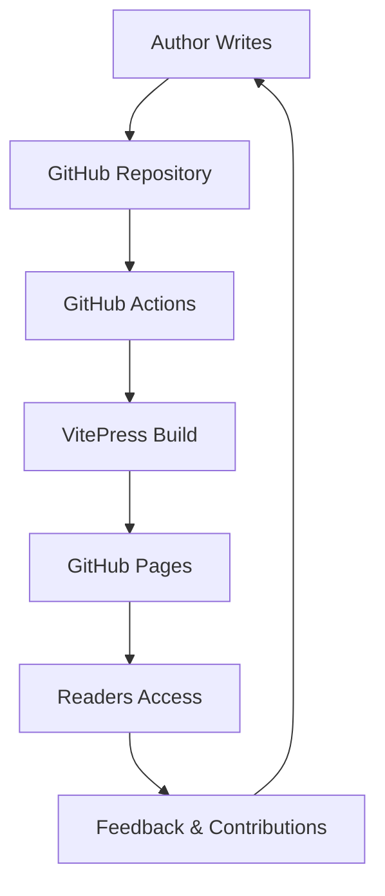

# 📖 Introduction to Dynamic Books

Welcome to the future of publishing! This dynamic book represents a new paradigm in content creation and distribution, where ideas live, breathe, and evolve in real-time.

## 🎯 What Makes This Book Special

Unlike traditional books that remain static after publication, this is a **living document** that:

- ✨ **Updates Instantly**: Changes are reflected immediately online
- 🔄 **Evolves Continuously**: Content improves based on feedback and new insights  
- 🤝 **Welcomes Collaboration**: Readers can contribute and suggest improvements
- 📊 **Tracks Changes**: Every modification is versioned and documented
- 🌐 **Reaches Globally**: Available 24/7 to anyone with internet access

## 🏗️ Technical Architecture

This dynamic book is built on a modern, robust technology stack:

### Core Technologies

- **📝 Markdown**: Simple, readable writing format
- **⚡ VitePress**: Modern static site generator for fast, beautiful sites
- **🔧 GitHub**: Version control, hosting, and automation
- **🚀 GitHub Actions**: Automated building and deployment
- **🌐 GitHub Pages**: Free, reliable hosting

## 📚 Content Overview

This book contains a curated collection of thoughts, research, and insights about:

### 🤖 AI and Education
Exploring how artificial intelligence is reshaping educational paradigms and learning methodologies.

### 💬 AI Communication
Personal reflections and practical insights from extensive interactions with AI systems like ChatGPT.

### 🔬 Research Insights  
Analysis of current academic research and its practical implications for real-world applications.

### 📝 Learning Records
Documentation of ongoing learning journeys, methodologies, and cognitive enhancement strategies.

## 🌟 Why Dynamic Publishing Matters

### Traditional Publishing Limitations
- 📅 **Slow Update Cycles**: Months or years between editions
- 💰 **High Costs**: Expensive printing and distribution
- 🚫 **Limited Reach**: Physical constraints on availability
- ❌ **No Interaction**: Readers can't contribute or provide feedback easily

### Dynamic Publishing Advantages
- ⚡ **Instant Updates**: Real-time content improvements
- 🆓 **Cost Effective**: Minimal publishing and distribution costs
- 🌍 **Global Reach**: Instantly available worldwide
- 🤝 **Interactive**: Readers become part of the creation process
- 📈 **Data-Driven**: Analytics help understand reader needs

## 🎨 Features and Capabilities

### For Readers
- 🔍 **Full-text Search**: Find any content instantly
- 📱 **Responsive Design**: Perfect on any device
- 🌙 **Dark Mode**: Comfortable reading in any environment
- 📊 **Progress Tracking**: See what's new since your last visit
- 💬 **Feedback Channels**: Easy ways to suggest improvements

### For Authors
- ✍️ **Simple Writing**: Focus on content, not formatting
- 🔄 **Version Control**: Track every change with Git
- 🚀 **Automatic Deployment**: Push to publish instantly
- 📊 **Analytics**: Understand your audience
- 🤝 **Collaboration Tools**: Manage contributions effectively

## 🚀 Getting Started as a Reader

1. **🏠 Start Here**: Begin with the homepage to understand the structure
2. **📑 Browse Articles**: Explore topics that interest you
3. **🔍 Use Search**: Find specific information quickly
4. **📱 Bookmark**: Save this site for regular reading
5. **🤝 Engage**: Share feedback through GitHub Issues

## 🤝 Contributing to This Book

We welcome contributions from readers! Here's how you can help:

### 📝 Content Contributions
- Suggest new topics or articles
- Improve existing content
- Fix typos or errors
- Add examples or case studies

### 🔧 Technical Improvements
- Enhance site performance
- Improve accessibility
- Add new features
- Fix bugs

### 📊 Feedback and Ideas
- Share reading experience feedback
- Suggest navigation improvements
- Recommend new sections
- Propose collaboration ideas

## 🔮 Future Vision

This dynamic book is just the beginning. We envision:

- **📈 Growing Community**: More contributors and readers
- **🔗 Interconnected Content**: Links between related concepts
- **🎥 Multimedia Integration**: Videos, interactive demos, and visualizations
- **🌐 Multi-language Support**: Content available in multiple languages
- **🤖 AI Enhancement**: AI-powered content suggestions and improvements
- **📊 Advanced Analytics**: Better understanding of reader needs

## 🏁 Ready to Explore?

Now that you understand what makes this book special, you're ready to dive in! 

**Next Steps:**
1. 📖 [Read the Update Guide](/en/update-guide) to understand how content evolves
2. 🤝 [Check the Contributing Guide](/en/contributing) to learn how you can participate
3. 📚 [Browse Articles](/en/articles/education-ai) to start reading content
4. ⭐ [Star the GitHub Repository](https://github.com/Zhanbingli/my_ebook) to stay updated

---

> 💡 **Remember**: This book is alive and evolving. What you read today might be enhanced tomorrow based on new insights, feedback, or discoveries. That's the beauty of dynamic publishing!

*Happy reading! 📚✨* 