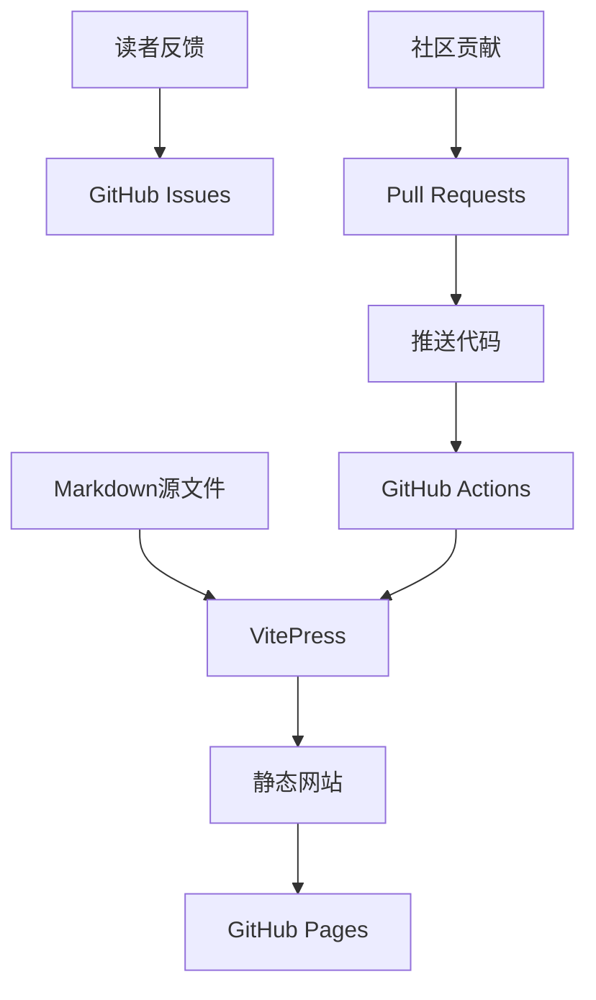

# 介绍

欢迎来到我的动态书籍项目！这是一个展示如何使用GitHub创建动态更新书籍的实例。

## 什么是动态书籍？

动态书籍是一种新型的数字出版形式，具有以下特点：

### 🔄 实时更新
- 内容可以随时更新和修正
- 读者总是能看到最新版本
- 支持版本历史追踪

### 👥 协作编写
- 多人可以贡献内容
- 通过Pull Request进行内容审核
- 利用GitHub的协作功能

### 📱 现代阅读体验
- 响应式设计，适配各种设备
- 内置搜索功能
- 支持代码高亮、数学公式等

## 为什么选择GitHub？

GitHub提供了理想的动态书籍基础设施：

### 版本控制
- **Git版本控制**：追踪每一次更改
- **分支功能**：并行开发不同章节
- **合并管理**：安全地集成贡献

### 协作功能
- **Issues**：收集读者反馈和建议
- **Pull Requests**：社区贡献内容
- **讨论**：围绕内容进行深入交流

### 自动化部署
- **GitHub Actions**：自动构建和部署
- **GitHub Pages**：免费托管
- **自定义域名**：专业的阅读体验

## 技术架构

这个项目使用以下技术栈：

### 核心组件

1. **VitePress** - 现代化的静态站点生成器
   - 基于Vue.js和Vite
   - 优秀的性能和开发体验
   - 丰富的主题和插件

2. **Markdown** - 内容编写格式
   - 简单易学的语法
   - 支持扩展功能
   - 版本控制友好

3. **GitHub Actions** - 自动化工作流
   - 自动构建和部署
   - 代码质量检查
   - 通知和集成

## 内容结构

本书包含以下主要内容：

### 📚 学术文章
- AI时代的教育变革
- 研究论文深度解析
- 教育理论与实践

### 💭 思考记录
- 与ChatGPT的对话记录
- 日常学习和研究笔记
- 灵感和想法收集

### 🛠️ 技术指南
- 如何创建动态书籍
- GitHub使用技巧
- 写作和发布流程

## 如何贡献

我们欢迎各种形式的贡献：

### 🐛 报告问题
发现错误或有改进建议？请[创建Issue](https://github.com/yourusername/my-dynamic-book/issues)

### ✏️ 内容贡献
想要贡献内容？请：
1. Fork这个仓库
2. 创建新分支
3. 添加或修改内容
4. 提交Pull Request

### 💡 想法和建议
通过[Discussions](https://github.com/yourusername/my-dynamic-book/discussions)分享想法

## 阅读指南

### 🎯 目标读者
- 教育研究者和从业者
- 技术爱好者
- 对AI和教育感兴趣的读者

### 📖 阅读建议
- 每章都有预估阅读时间
- 可以按兴趣选择章节阅读
- 建议结合实际案例思考

### 🔍 使用搜索
使用页面顶部的搜索功能快速定位内容

## 更新计划

这本书会持续更新，计划包括：

### 近期更新
- [ ] 完善现有文章的格式和内容
- [ ] 添加更多实际案例
- [ ] 改进导航和用户体验

### 中期计划
- [ ] 添加交互式示例
- [ ] 集成评论系统
- [ ] 多语言支持

### 长期愿景
- [ ] 构建学习社区
- [ ] 开发配套工具
- [ ] 扩展到其他主题

## 联系方式

如果您有任何问题或建议，可以通过以下方式联系：

- 📧 Email: your.email@example.com
- 🐦 Twitter: @yourusername
- 💼 LinkedIn: yourprofile

---

**准备好开始阅读了吗？** → [AI时代的教育变革](/articles/education-ai) 